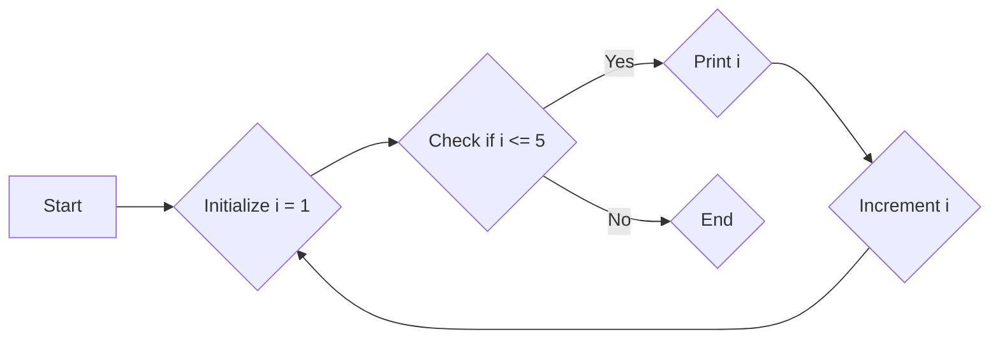
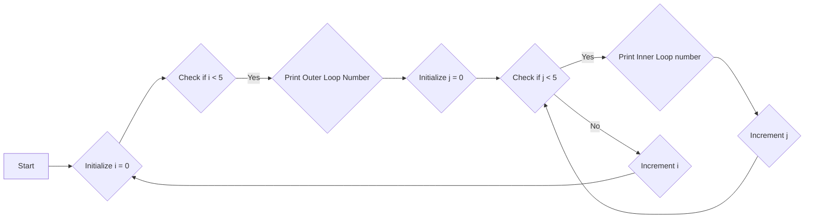

## Loops

Loops are control flow statements that allow repetitive execution of a block of code until a specified condition is met. They are used for iterating over sequences of data or performing repetitive tasks.

### For Loop

`for` loop: Iterates a specified number of times based on a counter variable.
**for loop Structure:** The general structure of a `for` loop is:

    ```
    for (initialization; condition; increment) {
        // code to execute repeatedly
    }
    For example:

    ```

- **Flow Chart of simple `for` loop:**



**`break` and `continue` Statements:**

- `break`: Terminates the loop immediately, even if there are remaining iterations.
- `continue`: Skips the current iteration and moves to the next iteration.

**`for` Loop with `if else`:**

```

for (let i = 0; i < 5; i++) {
if (i === 3) {
console.log(`${i} is the best`);
} else {
console.log(i);
}
}

```

**Nested For Loops:** Nested for loops involve embedding one loop within another. The inner loop executes for each iteration of the outer loop.

```

for (let i = 0; i < 5; i++) {
console.log(`Outer Loop Number ${i + 1}`);
for (let j = 0; j < 5; j++) {
console.log(` Inner Loop number ${j + 1}`);
}
}

```

- **Flow Chart of nested `for` loop:**



**Looping with Arrays**
`for` loops can be used to iterate over the elements of an array by accessing their indexes.

```

const myArray = ["a", "b", "c", "d", "f", "g", "h", "i"];
for (let i = 0; i < myArray.length; i++) {
console.log(myArray[i]);
}

```

### While and Do-While Loops

**While Loop**
The `while` loop is a control flow statement that executes a block of code repeatedly as long as a specified condition is true. It continues iterating until the condition becomes false.

**Structure of `while` Loop**

```
while (condition) {
  // code to execute repeatedly
}

```

**Do-While Loop**
The `do-while` loop is a variant of the `while` loop. It executes the block of code at least once before checking the condition. Unlike the `while` loop, the `do-while` loop guarantees at least one execution of the code block.

**Structure of `do-while` Loop**

```
do {
  // code to execute repeatedly
} while (condition);
```

### `for...of` Loop

The `for...of` loop is a control flow statement in JavaScript that iterates over the values of an iterable object. It provides a concise and convenient way to loop through iterables such as arrays, strings, and generators.
**Example**

```
const numbers = [1, 2, 3, 4, 5];

for (const number of numbers) {
  console.log(number);
}
```

**Working**

- **Initialization:** The loop starts by creating a loop variable and assigning it an iterator object using the `[@@iterator]()` method of the iterable object.
- **Condition Check:** The loop continues as long as the iterator object has more values to iterate over.
- **Value Assignment:** At each iteration, the loop retrieves the next value from the iterator object and assigns it to the loop variable.
- **Iteration:** The code block within the loop is executed using the current value of the loop variable.
- **Iteration Advancement:** After the code block execution, the iterator object is advanced to the next value, and the loop repeats until there are no more values to iterate over.

**Key Features**

- **Simple Syntax:** The `for...of` loop offers a simple and readable syntax compared to traditional `for` loops, especially when dealing with iterables.
- **Automatic Iteration:** It handles the iteration process internally, eliminating the need to manually manage an index or counter variable.
- **Iterable Support:** It can be used with various iterable objects, including arrays, strings, generators, and custom iterable objects.

**Notes**

- `for...of` loops can iterate over arrays which consists objects `[{},{},{}...]`
- But `for...of` loop can't iterate over regular objects and access their key-value pairs.
- `Map` (which is a type of Object that holds unique key-value pairs) are iteratable with `for...of` loop.

### `for...In` Loop

The `for...in` loop is a control flow statement in JavaScript that iterates over the **enumerable properties** of an object. It allows you to access and manipulate object properties in a structured manner.
**Working:**

**Property Enumeration:** The loop starts by creating a loop variable and assigning it an enumerator object, which represents the object's enumerable properties.

**Property Access:** At each iteration, the loop retrieves the next enumerable property name from the enumerator object and assigns it to the loop variable.

**Property Value Retrieval:** The value of the current property can be accessed using the loop variable as a key within the object.

**Iteration Advancement:** After retrieving the property value, the enumerator object is advanced to the next enumerable property, and the loop repeats until there are no more properties to iterate over.

**Key Features:**

- **Property-Based Iteration:** It focuses on iterating over the object's properties, providing direct access to property names and values.
- **Flexible Property Access:** It allows you to access properties using the loop variable, enabling dynamic property manipulation.
- **Object Exploration:** It is useful for exploring and understanding the structure and properties of an object.

**Example Usage:**

```
const person = {
  name: "John Doe",
  age: 30,
  occupation: "Software Engineer",
};

for (const property in person) {
  console.log(`${property}: ${person[property]}`);
}
```

**Notes**

- `for...in` loops can iterate over arrays which consists objects `[{},{},{}...]`
- `Map` is not iteratable with `for...in` loop.

## Higher Order OR Functional Loops

Higher-order loops, also known as functional loops, are a type of loop in JavaScript that utilizes functions to iterate over data structures. They provide a more powerful and expressive way to process collections compared to traditional `for` and `while` loops.

**Key Characteristics:**

- **Function Arguments:** Higher-order loops involve passing an iterable object or collection of data as an argument to a function.
- **Abstraction:** They encapsulate the iteration logic within a function, separating it from the actual data processing code.
- **Flexibility:** They allow for more complex and customizable iteration strategies compared to traditional loops.
  There are following higer order or functional loops.

### 1. `for...each` Loop

The forEach() method is a built-in method of the Array object in JavaScript. It provides a concise and convenient way to iterate over the elements of an array and execute a callback function for each element. It can also be classified as higher order or functional loop.

**Working:**

1.  **Parameter Binding:** The `forEach()` method takes a callback function as an argument. This callback function is executed for each element of the array.
2.  **Element Processing:** The callback function receives three arguments: the current element, the index of the current element, and the array itself.
3.  **Element Access:** The current element can be accessed directly within the callback function. The index provides the position of the current element within the array.
4.  **Iteration Advancement:** The `forEach()` method internally manages the iteration process, advancing to the next element after each callback function execution.
5.  **Iteration Completion:** The loop continues until all elements of the array have been processed.

**Example Usage:**

```
const numbers = [1, 2, 3, 4, 5];

numbers.forEach(number => console.log(number));
```

### 2. `filter()`

**`filter()` as a Higher-Order Function:** The `filter()` method is a higher-order function in JavaScript, meaning it takes a function as an argument and applies it to each element of an iterable object, such as an array.

**Filtering Based on Conditions:** The callback function provided to the `filter()` method evaluates a condition for each element. If the condition evaluates to true, the element is included in the filtered array; otherwise, it is excluded.

**Implicit Return:** The callback function can implicitly return the result of the condition evaluation, eliminating the need for an explicit `return` statement.

**Filtering Objects:** The `filter()` method can be used to filter arrays of objects based on specific properties of those objects.

**Combining Conditions with Logical Operators:** Logical operators like `&&` (AND) and `||` (OR) can be used within the callback function to combine conditions and filter based on more complex criteria.

### 3. `map()`

**`map()` as a Higher-Order Function:** The `map()` method is a higher-order function in JavaScript, meaning it takes a function as an argument and applies it to each element of an iterable object, such as an array.

**Transformation of Elements:** The callback function provided to the `map()` method transforms each element of the iterable object into a new value. The transformed values are collected into a new array, which is returned by the `map()` method.

**Automatic Result Collection:** Unlike the `forEach()` method, `map()` automatically collects and returns the transformed values, eliminating the need for manual collection.

**Chaining Methods:** The `map()` method can be chained with other array methods, such as `filter()`, to perform multiple operations on the data in a single step.

### `reduce()`

**`reduce()` as an Iterative Processing Function:** The `reduce()` method is an iterative processing function that combines elements of an iterable object into a single value. It applies a reducer function to each pair of elements in the iterable object, accumulating the result in an accumulator variable.

**Accumulator as a Carrier of State:** The accumulator is a variable that holds the accumulated value throughout the reduction process. It is initialized with an optional initial value and is updated with each iteration.

**Reducer Function as the Transformation Rule:** The reducer function defines how the accumulator should be updated based on the current element and the current accumulator value. It returns the updated accumulator value, which is used in the next iteration.

**Single Output Value:** The `reduce()` method returns a single value, representing the final accumulated outcome.
