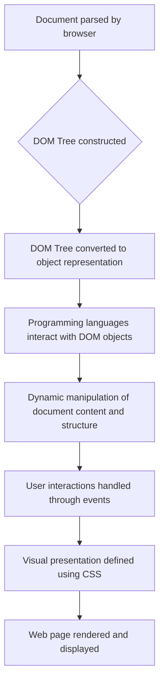

## DOM (Document Object Model)

The Document Object Model (DOM) is a cross-platform and language-independent interface that treats an HTML, XHTML, or XML document as a tree structure wherein each node is an object representing a part of the document. The DOM represents the document as nodes and objects; that way, programming languages can interact with the page.

**Key Concepts:**

1.  **Node-Based Structure:** The DOM represents the document as a tree of nodes, where each node represents a specific part of the document, such as an element, text, comment, or processing instruction.
2.  **Object Representation:** Each node in the DOM is represented as an object with attributes and methods. These attributes and methods allow you to manipulate the document's structure, content, and style.
3.  **Hierarchical Organization:** The nodes in the DOM are organized in a hierarchical parent-child relationship, reflecting the nesting structure of the document. This hierarchy allows you to navigate through the document and access specific elements efficiently.
4.  **Dynamic Manipulation:** The DOM enables dynamic manipulation of the document's content and structure. You can add, remove, or change elements, text, and attributes using JavaScript or other programming languages.

**Working:**

1.  **Parsing and Representation:** When a web browser encounters an HTML, XHTML, or XML document, it parses the document and constructs a DOM tree in memory. This tree represents the logical structure of the document, including all elements, text, comments, and processing instructions.
2.  **Object Access:** Programming languages can access and manipulate the DOM tree using JavaScript or other DOM-compliant languages. These languages provide methods for accessing, modifying, and creating nodes, enabling dynamic interactions with the document.
3.  **Event Handling:** The DOM supports event handling, allowing you to respond to user interactions, such as clicks, key presses, and mouse movements. Event listeners can be attached to specific elements or the entire document, triggering actions when the corresponding events occur.
4.  **Styling and Presentation:** The DOM is closely linked to Cascading Style Sheets (CSS), which define the visual presentation of the document. The DOM provides methods for accessing and manipulating CSS properties, enabling dynamic styling and layout adjustments.

**Flowchart of Working of DOM**



**Acessing DOM Document of a Web Page**

1. Go to a webpage, right-click anywhere to see browser options.
2. From those options, select **Inspect** option. It will open a side window. From there we can see **Elements** tab. It shows the html code of the webpage. It can also be called document but To get more information about DOM document, we proceed to next steps.
3. In top bar of the side window, look for **Console** tab, or click **>>** to see it.
4. In console window, write `console.log(window)`. It will return global window object which contains all the information and resources related/comes to that webpage. In that global window object, there is document object which also contains a lot of information and resources.
5. In console, write `console.log(window.document)` or simply `console.log(document)`. It will return the html code of the webpage, but this document object will be different from one we saw in output of `console.log(window)` window object.
6. To see the similar object as present in expansion of `window` object, we can write `console.dir(document)`
7. So this document object has all information like the whole document tree,html tags, innerHTML in those tags, links, attributes etc of that webpage. So To access a specific section or text on a webpage, we have to use the document object.

**Acessing or Manipulating Specific section of the DOM Document**
In case we want to see the html and properties of a specific section or text on a webpage, instead of going through all above step, we can simply:

- goto that section, `right-click > inspect`. It will open a side windows showing html and css of that object,
- we can directly type in that html/css to manipulate that text / section

More optimal way to manipulate DOM is by using JS. To do this, we can goto console tab.For example we want
to manipulate text of an `h1` tag which has `id` = "1", we can access it with document object.

1. In console tab, write `document.getElementbyId('1')`. It will give the html code of it's tag which is
   `h1` in this case.
2. Again write `document.getElementbyId('1').innerHTML = "Any other text"`
3. Code in step 2 will replace the text of h1 by the entered text

## NodeList and HTMLCollection

Both NodeList and HTMLCollection are array-like objects in the Document Object Model (DOM) that represent collections of nodes in an HTML document. They are used to access and manipulate groups of elements in the DOM structure.
**Working:**

- **NodeList:** A NodeList is a live collection, meaning that changes to the underlying document structure are reflected in the NodeList. It is typically generated by methods like `getElementsByTagName()`, `getElementsByClassName()`, and `querySelectorAll()`.
- **HTMLCollection:** An HTMLCollection is a static collection, meaning that changes to the underlying document structure do not affect the HTMLCollection. It is typically generated by methods like `getElementsByName()`, `getElementbyId()` and `getElementsByTagName()`

**Methods:**

Both NodeList and HTMLCollection share some common methods for accessing and manipulating the nodes they contain:

- `length`: Returns the number of nodes in the collection.
- `item(index)`: Retrieves the node at the specified index.
- `namedItem(name)`: Retrieves the node with the specified name (only for HTMLCollection).
- `forEach(callback)`: Iterates over the nodes in the collection and calls the provided callback function for each node.
- `[Symbol.iterator]()`: Returns an iterator object that allows the collection to be iterated over using a for...of loop.

**Content:**

- **NodeList:** A NodeList can contain any type of node in the DOM tree, including element nodes, text nodes, attribute nodes, and comment nodes.
- **HTMLCollection:** An HTMLCollection only contains element nodes.

**Differences:**

The main difference between NodeList and HTMLCollection lies in their liveness:

- **Live vs. Static:** NodeList is a live collection, while HTMLCollection is a static collection. This means that changes to the underlying document structure are reflected in NodeList, but not in HTMLCollection.
- **Accessibility:** NodeList can contain any type of node, while HTMLCollection only contains element nodes. This makes NodeList more versatile and suitable for accessing a wider range of DOM elements.

**Examples:**

**Using NodeList:**

```
<div id="container">
  <p>Paragraph 1</p>
  <p>Paragraph 2</p>
  <p>Paragraph 3</p>
</div>

<script>
  const paragraphs = document.getElementById('container').childNodes;
  for (const paragraph of paragraphs) {
    if (paragraph.nodeType === 1) {
      console.log(paragraph.textContent);
    }
  }
</script>

```

This code snippet retrieves the NodeList of child nodes of the element with the id "container" and iterates over the nodes, printing the text content of each paragraph element.

**Using HTMLCollection:**

```
<div id="container">
  <p class="paragraph">Paragraph 1</p>
  <p class="paragraph">Paragraph 2</p>
  <p class="paragraph">Paragraph 3</p>
</div>

<script>
  const paragraphs = document.getElementsByClassName('paragraph');
  for (const paragraph of paragraphs) {
    console.log(paragraph.textContent);
  }
</script>

```

This code snippet retrieves the HTMLCollection of elements with the class "paragraph" and iterates over the elements, printing the text content of each paragraph.

### `document` or DOM selectors:

**1. getElementById()**

- **Explanation:** Selects the element with the specified ID.
- **Return Value:** A single element if found, or `null` if not found.
- **Returns:** An element
- **Example:** `document.getElementById("wrapper")`

**2. getElementsByClassName()**

- **Explanation:** Selects all elements with the specified class.
- **Return Value:** A NodeList of elements with the specified class.
- **Returns:** A NodeList
- **Example:** `document.getElementsByClassName("parent")`

**3. getElementsByTagName()**

- **Explanation:** Selects all elements with the specified tag name.
- **Return Value:** A NodeList of elements with the specified tag name.
- **Returns:** A NodeList
- **Example:** `document.getElementsByTagName("div")`

**4. querySelector()**

- **Explanation:** Selects the first element that matches the specified CSS selector.
- **Other Arguments:** A CSS selector string
- **Return Value:** The first matching element, or null if no match is found.
- **Returns:** An element
- **Example:** `document.querySelector(".parent")`

**5. querySelectorAll()**

- **Explanation:** Selects all elements that match the specified CSS selector.
- **Other Arguments:** A CSS selector string
- **Return Value:** A NodeList of matching elements.
- **Returns:** A NodeList
- **Example:** `document.querySelectorAll(".day")`
