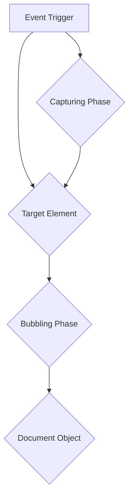
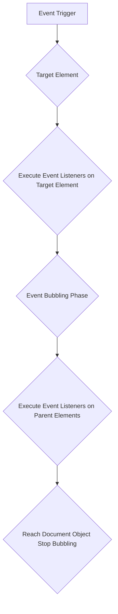
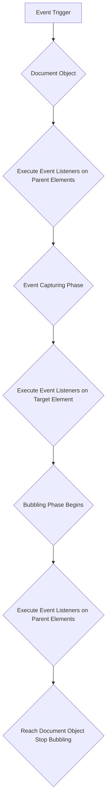

## DOM Events

DOM (Document Object Model) events are the interactions that occur between a user and a web page. These events trigger specific actions or behaviors within the page, such as responding to user clicks, mouse movements, keyboard presses, and form submissions.

**How DOM Events Work:**

1.  **Event Dispatch:** When a user interacts with the web page, the browser creates an event object that encapsulates the details of the interaction.
2.  **Event Bubbling:** The event object is passed up the DOM tree, from the target element to its parent elements, until it reaches the document object. This is called event bubbling.
3.  **Event Capturing:** If the event object is prevented from bubbling, it can be captured by event listeners attached to parent elements. This is called event capturing.
4.  **Event Handler Execution:** Event listeners attached to the target element or its parent elements are executed in the order they were attached.

### Types of DOM Events

DOM events can be categorized into several types based on their functionality and the user interactions they represent:

1.  **UI Events:** These events are triggered by interactions with the user interface elements, such as clicking, hovering, or scrolling. Examples include `click`, `mouseover`, `mouseout`, `scroll`, `focus`, and `blur`.
2.  **Keyboard Events:** These events are triggered by keyboard interactions, such as pressing, releasing, or holding клавишаs. Examples include `keydown`, `keyup`, `keypress`, and `beforeinput`.
3.  **Mouse Events:** These events are triggered by mouse interactions, such as clicking, moving, and scrolling. Examples include `mousedown`, `mouseup`, `mousemove`, `wheel`, `contextmenu`, and `mouseenter`.
4.  **Form Events:** These events are triggered by form interactions, such as submitting, resetting, or changing form values. Examples include `submit`, `reset`, `change`, and `focus`.
5.  **Document Events:** These events are triggered at the document level, such as loading, unloading, and errors. Examples include `load`, `unload`, `error`, `DOMContentLoaded`, and `readystatechange`.
6.  **Drag and Drop Events:** These events are triggered by drag-and-drop interactions, such as dragging, dropping, and entering a drop zone. Examples include `dragstart`, `drag`, `dragend`, `dragenter`, `dragover`, `dragleave`, `drop`, and `dragdrop`.

**Important Properties of the Global Event Object**

The global event object, accessible within event listener functions, provides various properties that contain information about the event and the user interaction. Some important properties include:

1.  **type:** The type of event, such as `click`, `keydown`, or `submit`.
2.  **target:** The element that triggered the event.
3.  **currentTarget:** The element that the event listener is attached to.
4.  **srcElement:** An alias for `target` in older browsers.
5.  **timeStamp:** The timestamp of the event in milliseconds since the UNIX epoch.
6.  **preventDefault():** A method to prevent the default behavior associated with the event, such as submitting a form.
7.  **clientX/clientY:** The coordinates of the mouse pointer relative to the viewport.
8.  **screenX/screenY:** The coordinates of the mouse pointer relative to the entire screen.
9.  **width/height:** The width and height of the element that triggered the event (for mouse events).
10. **toElement:** The element that the mouse pointer is moving into (for mouseover and mouseenter events).

11. **altKey/ctrlKey/shiftKey:** Boolean values indicating whether the Alt, Ctrl, or Shift key is pressed during the event.

12. **keyCode:** The Unicode code of the key pressed for keyboard events.

These properties provide essential information about the event and the user interaction, allowing developers to handle events effectively and implement custom behaviors.

### Event Propagation

Event propagation is the mechanism by which DOM events travel up the DOM tree, from the target element (the element that initially triggered the event) to its parent elements, until they reach the document object. This allows developers to handle events at a higher level in the DOM hierarchy, rather than attaching event listeners to every element that might receive the event.

**Types of Event Propagation**

There are two main types of event propagation:

2.  **Event Bubbling:** This is the default behavior of event propagation. In bubbling, the event object travels up the DOM tree from the target element to the document object. At each level, event listeners attached to the current element and its parent elements are executed.
3.  **Event Capturing:** In event capturing, the event object travels down the DOM tree from the document object to the target element. At each level, event listeners attached to the parent elements are executed before the event reaches the target element.

**Working of Event Bubbling**

Here's a step-by-step explanation of how event bubbling works:

1.  **Event Trigger:** The user interacts with the web page, triggering an event.
2.  **Target Element:** The event is initially handled by the target element, the element that the user directly interacted with.
3.  **Bubbling Phase:** The event object travels up the DOM tree, starting from the target element's parent. At each level, event listeners attached to the current element and its parent elements are executed.
4.  **Document Object:** If the event object reaches the document object, it is considered handled and no further bubbling occurs.

**Working of Event Capturing**

Here's a step-by-step explanation of how event capturing works:

1.  **Event Trigger:** The user interacts with the web page, triggering an event.
2.  **Document Object:** The event object first encounters the document object.
3.  **Capturing Phase:** The event object travels down the DOM tree, starting from the document object. At each level, event listeners attached to the current element and its parent elements are executed.
4.  **Target Element:** Once the event object reaches the target element, the bubbling phase begins, as described above.
