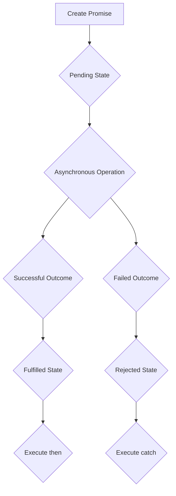
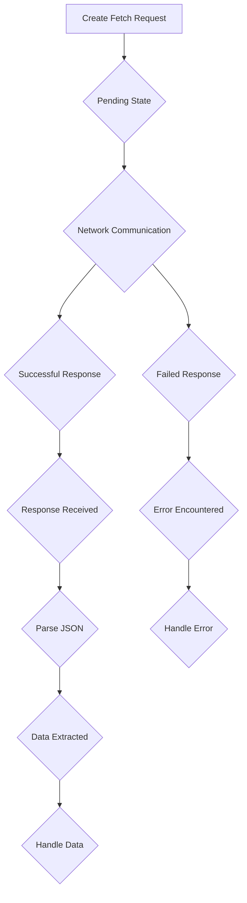

## Promises and fetch() in JS

### Promises

Promises represent the eventual completion (or failure) of an asynchronous operation. A promise is an object representing completion or failure of async operation. They encapsulate the result or error of the asynchronous task, enabling developers to handle the outcome effectively.

**History**

1. **Before Promises:**

- Callbacks: Callbacks were the original mechanism for handling asynchronous operations in JavaScript. They involve passing a function as an argument to another function, which is then executed when the asynchronous operation completes.

2. **Introduction of Promises:**

- **Promises were introduced in ECMAScript 2015 (ES6) as a more structured and organized way to handle asynchronous operations.**

3. **Inclusion in JavaScript and Node.js:**

- Promises were natively included in JavaScript in ES6 and became available in Node.js starting with version 0.11.13.

**Working of Promises**

Promises have three states: pending, fulfilled, and rejected.

1.  **Pending:** Initially, a promise is in the pending state, indicating that the asynchronous operation is still in progress.
2.  **Fulfilled:** When the asynchronous operation completes successfully, the promise transitions to the fulfilled state. The result of the operation is stored in the promise's fulfillment value.
3.  **Rejected:** If the asynchronous operation encounters an error, the promise transitions to the rejected state. The error information is stored in the promise's rejection reason.

**Promise Creation**

Promises are created using the `new Promise()` constructor, passing it an executor function. The executor function receives two arguments: a resolve function and a reject function.

```
const promise = new Promise((resolve, reject) => {
  // Asynchronous operation
  if (operationSuccessful) {
    resolve(operationResult);
  } else {
    reject(operationError);
  }
});

```

Once the promise is created, it can be used with `then()` and `catch()` methods.

```
promise.then(result => {
  // Handle successful operation
  console.log("Operation succeeded:", result);
}).catch(error => {
  // Handle error
  console.error("Operation failed:", error);
});
```

`then()` is used to handle the fulfillment of the promise, while `catch()` is used to handle rejection. They receive callback functions that will be executed when the promise transitions to their respective states.

**Promise Consumption**

- Promises can be chained together to handle complex asynchronous workflows.
- Each `then()` method can return a promise, allowing the next `then()` method to handle the result of the previous promise.
- `catch()` method can be placed at the end of the chain to handle any errors that occur throughout the entire sequence of asynchronous operations.

**Real-Life Usage Scenarios**

Promises are widely used in various scenarios, including:

1.  **Fetching Data:** Promises are commonly used to handle asynchronous data retrieval, such as fetching data from APIs or servers.
2.  **File Operations:** Asynchronous file operations, such as reading or writing files, can be managed using promises.
3.  **User Interactions:** Handling user interactions like asynchronous requests or responses can be effectively done with promises.
4.  **Complex Asynchronous Logic:** Promises can be chained together to handle complex asynchronous workflows, ensuring proper execution order and error handling.

**Flowchart of Promise Execution**



### Fetch API in JavaScript

**Concept**

The Fetch API is a modern and more convenient way to make HTTP requests in JavaScript. It provides a Promise-based interface for fetching data from servers, simplifying the process of handling asynchronous network operations.

**Notes:**

- A `fetch()` promise only rejects when a network error is encountered (like permission problems
  or similar).
- HTTP errors like `404`, `304`, `200` etc are returned in response, not rejected.

**History**

1. **Before Fetch API:**

- XMLHttpRequest (XHR): XHR was the traditional method for making HTTP requests in JavaScript. It involved creating an XMLHTTPRequest object, configuring it with request details, and handling the response using callbacks.

2. **Introduction of Fetch API:**

- The Fetch API was introduced in ECMAScript 2015 (ES6) as a more streamlined and intuitive alternative to XHR.

3. **Inclusion in JavaScript and Node.js:**

- The Fetch API became natively available in JavaScript browsers starting with ES6.
- Node.js adopted the Fetch API in later versions, integrating it with the Node.js runtime environment.

**Working of Fetch API**

Making a request using the Fetch API involves calling the `fetch()` function, passing it the URL of the resource you want to fetch. The `fetch()` function returns a promise that resolves to a Response object containing the response from the server.

```
fetch('https://jsonplaceholder.typicode.com/posts/1')
  .then(response => response.json())
  .then(data => console.log(data))
  .catch(error => console.log(error))
```

- The `fetch()` function returns a promise that resolves to a Response object.
- The `then()` method is used to handle the successful response.
- The `response.json()` method parses the JSON response.
- The second `then()` method handles the parsed JSON data.
- The `catch()` method handles any errors that occur during the request or response processing.

**Async/Await with Try/Catch**

The `async` and `await` keywords provide a more concise and synchronous-like syntax for handling asynchronous operations. They simplify the use of Promises, making the code easier to read and understand.

```
try {
  const response = await fetch('https://jsonplaceholder.typicode.com/posts/1');
  const data = await response.json();
  console.log(data);
} catch (error) {
  console.error('Error:', error);
}

```

In this example, the `await` keyword pauses the execution of the async function until the promise is resolved or rejected. The `try/catch` block handles any errors that occur during the asynchronous operation.

**Flowchart of Fetch API Execution**


