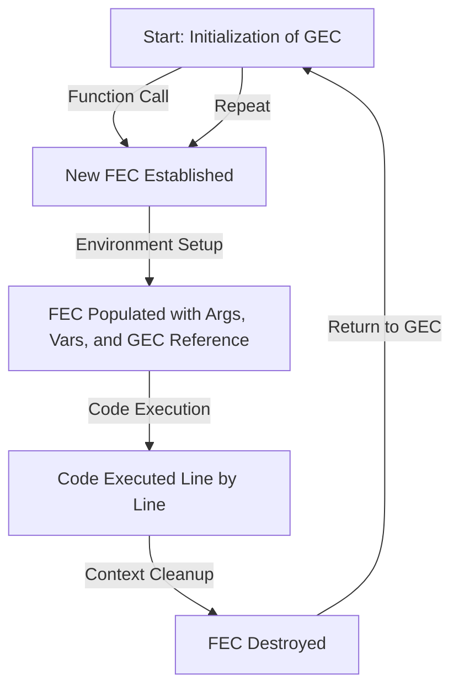
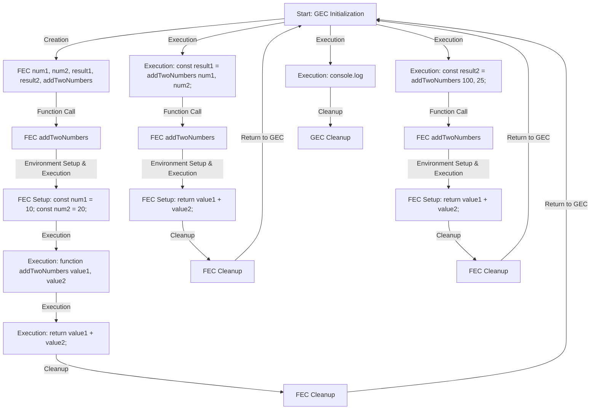
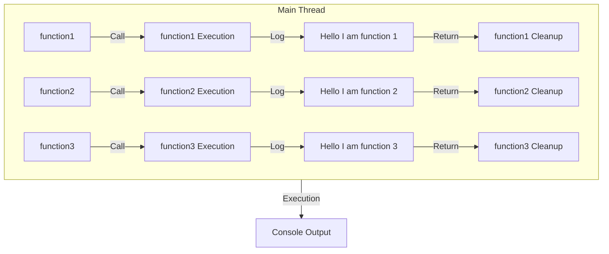
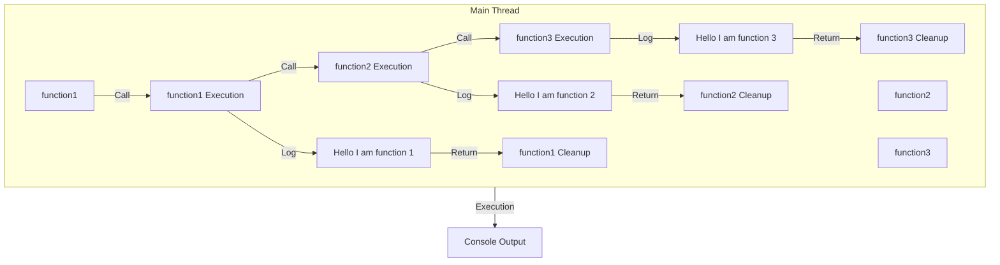
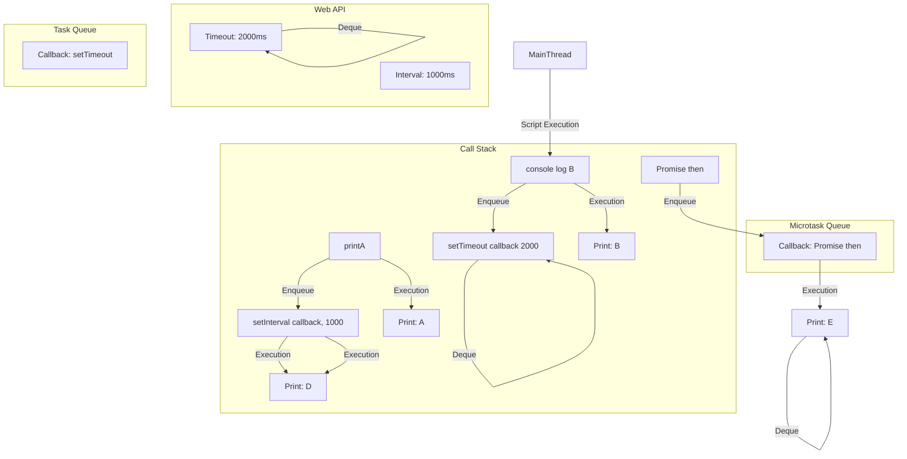

## Understanding JavaScript Execution Context

In JavaScript, the execution context is an environment that facilitates the execution of JavaScript code. It encompasses the variables, functions, and other resources available to the code during its execution. The execution context plays a crucial role in determining how JavaScript code is interpreted and processed.

### Types of Execution Contexts

There are two primary types of execution contexts in JavaScript:

1.  **Global Execution Context (GEC):** The GEC is the default execution context created when a JavaScript script is loaded. It contains all variables and functions declared outside of any function blocks.
2.  **Function Execution Context (FEC):** An FEC is created for each function call. It contains the function's arguments, local variables, and a reference to the global execution context.

### Execution Context Creation and Execution Phases

When JavaScript code is executed, the execution context undergoes two main phases:

1.  **Memory Creation OR Creation Phase:** In this phase, the JavaScript engine analyzes the code and prepares the execution context. This includes creating the variable environment, defining function scopes, and allocating memory for variables and functions.
2.  **Execution Phase:** During this phase, the JavaScript engine executes the code line by line. This involves evaluating expressions, assigning values to variables, calling functions, and handling control flow statements.

### The Role of `this` Keyword

The `this` keyword in JavaScript refers to the current execution context. Its value depends on how the code is called:

- **In objects:** Within an object method, `this` refers to the object itself.
- **In global functions:** In a global function, `this` refers to the global object, which is the `window` object in browsers and the global `Node.js` object in Node.js environments.
- **In arrow functions:** Arrow functions inherit the `this` binding from their surrounding scope.

### Execution Flow Chart



This flowchart depicts the creation and execution of execution contexts in JavaScript:

1.  **Start:** The process begins with the initialization of the global execution context (GEC).
2.  **Function Call:** When a function is called, a new function execution context (FEC) is created.
3.  **Environment Setup:** The FEC is populated with the function's arguments, local variables, and a reference to the global execution context (GEC).
4.  **Code Execution:** The code within the function body is executed line by line.
5.  **Context Cleanup:** Upon completion of the function execution, the FEC is destroyed.
6.  **Return to GEC:** Control returns to the GEC, or the execution context from which the function was called.
7.  **Repeat:** The process can repeat for subsequent function calls and the execution of code within the GEC.

### Example Code and It's Execution Context Flowchart

**Code**

```
const num1 = 10;
const num2 = 20;
function addTwoNumbers(value1, value2){
return value1+value2
};
const result1 = addTwoNumbers(num1, num2);
const result2 = addTwoNumbers( 100, 25);
console.log(`Result 1: ${result1} ,   Result 2: ${result2}`);
```

**Flow chart**



## Understanding the Call Stack in JavaScript

The call stack in JavaScript is a data structure that keeps track of the order in which functions are called. It is a LIFO (Last In, First Out) stack, which means that the most recently called function is always at the top of the stack.
The call stack is used by the JavaScript engine to manage the execution of functions. When a function returns, its stack frame is popped off the stack, and the function that called it resumes execution.

### Working of the Call Stack

1.  **Function Invocation:** When a function is called, a new stack frame is pushed onto the call stack.
2.  **Code Execution:** The code within the function body is executed line by line.
3.  **Function Return:** Upon completion of the function execution, the stack frame is popped off the call stack.
4.  **Resume Execution:** Control returns to the function that called the returned function, and its execution resumes.

### Call Stack in Function Nesting

When functions are nested, the call stack reflects this nesting. Each nested function's stack frame is pushed onto the stack above the stack frame of the calling function.

### Importance of the Call Stack

The call stack plays a crucial role in JavaScript execution:

- **Function Context Management:** It maintains the context of each function call, including its arguments, local variables, and return address.
- **Error Tracking:** It facilitates error tracking by providing a record of the sequence of function calls leading to an error.
- **Debugging:** It aids in debugging by allowing developers to step through the execution of functions and examine their stack frames.

### Examples of Working of Call Stack

**Code**

```
const function1 = () => {
  return console.log(`Hello I am function 1`);
};
const function2 = () => {
  return console.log(`Hello I am function 2`);
};
const function3 = () => {
  return console.log(`Hello I am function 3`);
};
function1();
function2();
function3();
```

**FlowChart**



### In Case of Nested functions

**Code**

```
const function1 = () => {
  const function2 = () => {
    const function3 = () => {
      return console.log(`Hello I am function 2`);
    };
    function3();
    return console.log(`Hello I am function 3`);
  };
  function2();
  return console.log(`Hello I am function 1`);
};

function1();
```

**Flowchart**



## Execution


